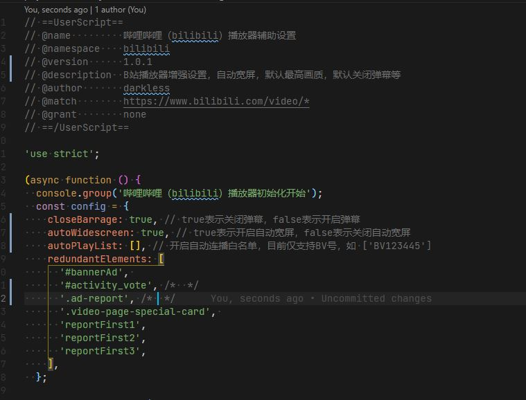

# 哔哩哔哩（bilibili）播放器辅助设置

## 适用范围

B 站的视频播放页（暂不含首页）

## 浏览器支持

新版 Chrome、Firefox 都是支持的，但是旧版不支持，因为代码使用比较新的语法

## 功能

- 自动宽屏
- 默认关闭弹幕
- 关闭自动连播
- 默认最高画质
- 自动展开简介
- 移除部分广告元素

## 关闭部分设置（需修改代码配置）

在代码的如下位置：

## 源码

https://github.com/darkless456/bilibili_scripts

## 联系方式

如有问题，欢迎留言或者提issue
